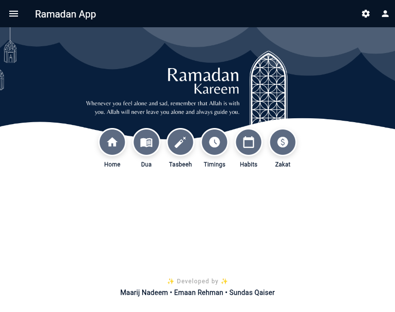
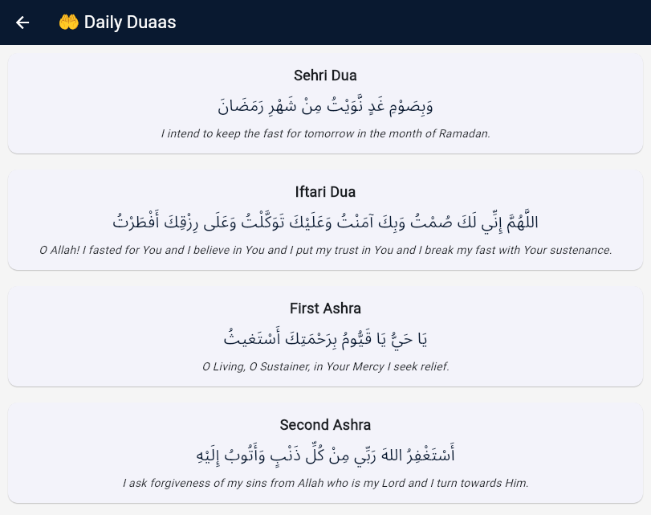
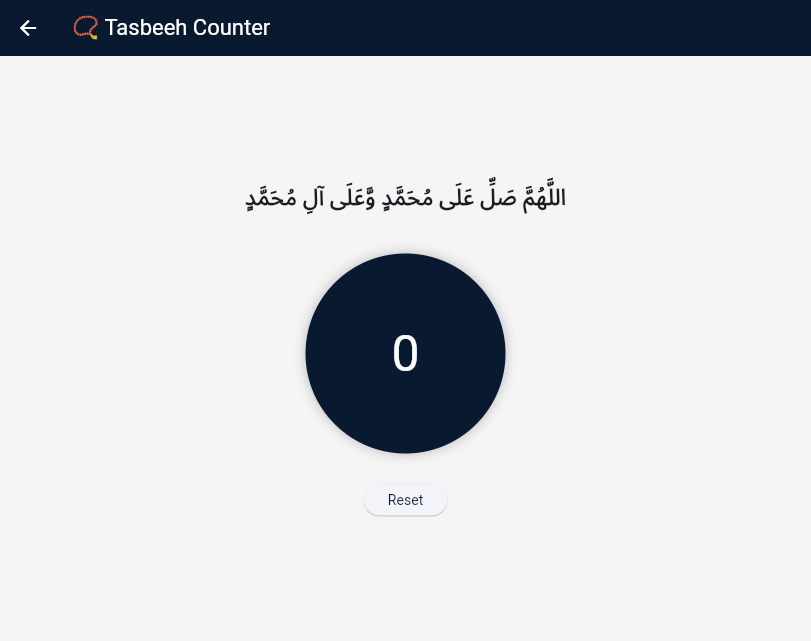
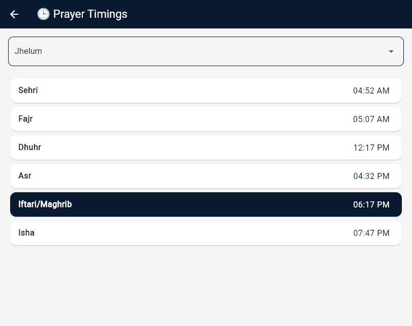
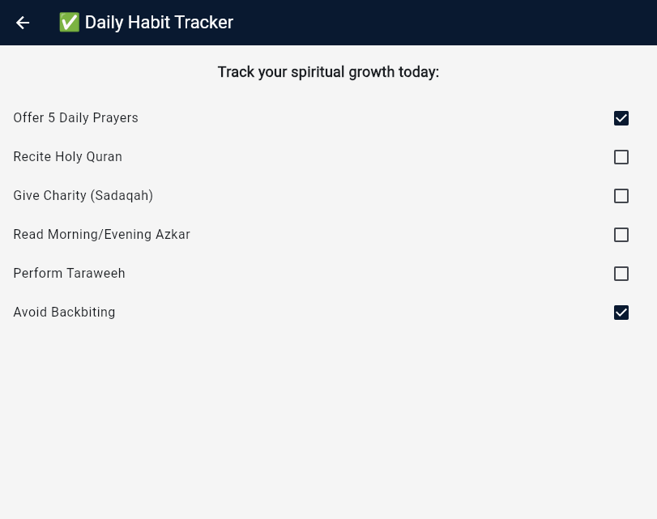
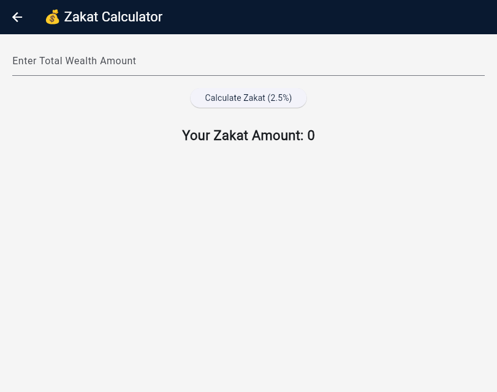

# Ramadan Flutter App

## Overview

A Flutter application designed to help Muslims during Ramadan by providing useful Islamic tools in a single mobile application.

## Features

- Ramadan Timings
- Daily Duas
- Digital Tasbeeh Counter
- Habit Tracker
- Zakat Calculator
- User-Friendly Interface

## Technologies Used

- Flutter
- Dart
- Material Design

## Screenshots

### Home Screen

### Dua Page

### Tasbeeh Counter

### Ramadan Timings

### Habit Tracker

### Zakat Calculator

## Author

Emaan Rehman

BS Computer Science Student

### Connect With Me

- GitHub: https://github.com/emaan-rehman
- LinkedIn: linkedin.com/in/emaan-rehman-34175a310
